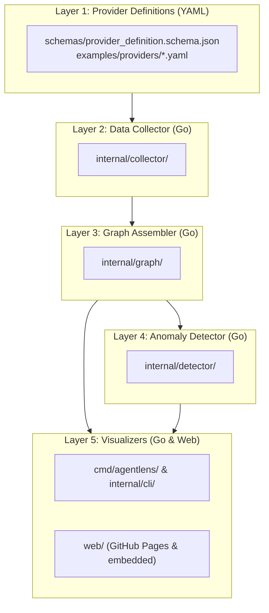

# AGENTS.md — AI Agent Guidance & Architecture Briefing

> **Target Audience**: AI coding assistants (Antigravity, Claude Code, Cursor, Copilot Workspace, Codex, Devin, etc.) collaborating on AgentLens.

Welcome, AI agent! This repository is optimized for AI-driven pair programming. Read this document thoroughly before proposing or implementing changes.

---

## 1. Project Mission & Core Value

**AgentLens** is an open-source, zero-dependency observability tool and call graph visualizer for Generative AI systems.

### The Problem It Solves
When Generative AI runs in autonomous mode, it invokes skills, MCP (Model Context Protocol) servers, and subagents. When an external MCP tool fails or its credentials (OAuth/tokens) expire, AI agents often attempt **silent fallbacks** (e.g. falling back to shell `curl`/`gh` commands or routing indirectly through a secondary tool). This degrades quality and causes hidden errors without alerting the user.

### Key Capabilities
1. **Call Graph Reconstruction (DAG)**: Maps turns, agents, skills, and MCP tool executions.
2. **Silent Fallback & Anomaly Detection**: Detects HTTP 401/403, indirect proxy routing, and unexpected tool substitutions.
3. **Strict Provider Agnosticism**: AI platform specifics are isolated exclusively into declarative YAML definitions.
4. **Zero-Dependency CLI & Dual Web UI**: Written in Go (single binary), bundled with an embedded Web UI (`agentlens ui`) and a 100% free client-side viewer on **GitHub Pages** (`https://tsbkw.github.io/agentlens`).

---

## 2. Strict Architectural Boundaries (The 5 Layers)

You MUST respect the 5-layer separation. NEVER introduce AI platform-specific parsing into core layers:



### Absolute Rule
- **NEVER** write platform-specific `if provider == "antigravity"` conditions inside `internal/graph`, `internal/collector`, `internal/detector`, or `internal/server`.
- All platform extraction rules must be read from the declarative provider configuration (`schemas/provider_definition.schema.json`).

---

## 3. Tech Stack & Repository Map

| Component | Technology | Path |
| :--- | :--- | :--- |
| **Language & Core** | Go 1.23+ | `cmd/agentlens/`, `internal/` |
| **Data Models** | Go structs (`models.CallNode`, `models.CallEdge`) | `internal/models/` |
| **Provider Schema** | JSON Schema (Draft 2020-12) | `schemas/provider_definition.schema.json` |
| **Provider Examples** | Declarative YAML | `examples/providers/` |
| **Web UI** | HTML5 / CSS / Vanilla TS or lightweight SPA | `web/` |
| **GitHub Pages** | GitHub Actions (`actions/deploy-pages@v4`) | `.github/workflows/deploy-pages.yml` |
| **CI Automation** | GitHub Actions (`go test`, `go vet`, build) | `.github/workflows/ci.yml` |

---

## 4. Development Workflow for AI Agents

Whenever you work on this repository, strictly follow this procedure:

### Step 1: Branch Creation
Never modify or push to `main` directly.
```bash
git checkout -b feat/<descriptive-name>
# or fix/<descriptive-name>, docs/<descriptive-name>
```

### Step 2: Implementation & Quality Verification
Before finishing your turn or opening a PR:
- Run Go tests: `go test -v -race ./...`
- Run static checks: `go vet ./...`
- Verify binary compiles: `go build ./cmd/agentlens`

### Step 3: Roadmap Progress Update
Every PR that advances a milestone **must** update the task checkboxes in both:
- [`docs/en/ROADMAP.md`](docs/en/ROADMAP.md)
- [`docs/ja/ROADMAP.md`](docs/ja/ROADMAP.md)

### Step 4: Language & Documentation Policy
- **Code & Comments**: Strictly **English** (`en`).
- **Documentation**: All documentation is maintained in parallel in English (`docs/en/`) and Japanese (`docs/ja/`). When modifying specs or architecture, update both.

### Step 5: Pull Request & Merge Workflow
- Open a PR using `gh pr create --fill` adhering to [`.github/pull_request_template.md`](.github/pull_request_template.md).
- **Review Policy**:
  - The repository owner/maintainer (`tsbkw`) can merge PRs at any time.
  - Other contributors require an approving review from a maintainer before merge.

---

## 5. Quick Context Index

- [Functional Specification (EN)](docs/en/SPECIFICATION.md) | [(JA)](docs/ja/SPECIFICATION.md)
- [System Architecture (EN)](docs/en/ARCHITECTURE.md) | [(JA)](docs/ja/ARCHITECTURE.md)
- [Development Roadmap (EN)](docs/en/ROADMAP.md) | [(JA)](docs/ja/ROADMAP.md)
- [Contributing Guidelines (EN)](docs/en/CONTRIBUTING.md) | [(JA)](docs/ja/CONTRIBUTING.md)
- [Provider JSON Schema](schemas/provider_definition.schema.json)
