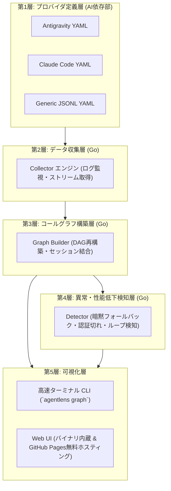

# AgentLens 🔍

> **生成AIのSKILL・MCP・サブエージェント呼び出しを可視化する環境非依存のコールグラフ・オブザーバビリティツール**

[](https://opensource.org/licenses/MIT)
[](https://go.dev/)
[](README.md)
[](README.ja.md)
[](https://tsbkw.github.io/agentlens)

---

## 🌟 概要

自律実行モード（auto mode）で動作する生成AIエージェントは、多種多様な **SKILL** や **MCP (Model Context Protocol) サーバー**、サブエージェントを動的に呼び出してタスクを進めます。

しかし、実行の裏側で「実際に何がどのように呼び出されているのか」は極めて不透明になりがちです。外部MCPの認証（OAuthやAPIキー等）が期限切れになった場合やSKILLでエラーが発生した際、AIは**ユーザーに通知することなく暗黙的なフォールバック（別ツールへの迂回試行）**を行うことがあります（例: 認証切れのGitHub MCPの代わりにシェルで `curl` や `gh` コマンドを実行するなど）。その結果、コンテキストの脱落や性能の低下、不十分な成果物に終わるリスクがあります。

**AgentLens** は、AIのツール呼び出しプロセスの完全な透明化を実現します:
- 🚀 **環境依存ゼロ（単一バイナリ配布）**: Go言語製。Python や Node.js の事前インストールは一切不要で、Mac・Linux・Windowsの各OSでダウンロードして即実行できます。
- 📊 **コールグラフ（有向非巡回グラフ: DAG）再構築**: エージェントの実行フロー、SKILL呼び出し、MCPツール利用を有向グラフとして統合。
- 🚨 **暗黙フォールバック & 異常検知**: 認証失効（HTTP 401/403）や迂回ルーティング、予期せぬツール代替を自動検出して警告。
- 🔌 **生成AI製品に依存しない設計**: ログ形式やトレース抽出の定義を宣言的な YAML 設定（プロバイダ定義）に完全分離。Google Antigravity、Claude Code、Cursor、独自エージェント等に対応。
- 🖥️ **CLI & Web UI の双方で可視化**:
  - **ターミナル CLI**: 高速な色分けツリー表示と詳細インスペクター。
  - **Web UI**: Goバイナリ内蔵サーバー（`agentlens ui`）による完全オフライン表示に加え、**GitHub Pages 上で完全無料ホスティング**（ブラウザ完結型・外部送信なしの安全なドラッグ＆ドロップ可視化）。

---

## 🏗️ アーキテクチャ

AgentLens は厳密な **5層の責任分離** を採用しています。生成AI固有の仕様を知っているのは第1層（プロバイダ定義層）のみです:



---

## 🌐 GitHub Pages による無料Web UI と ローカル内蔵UI

Web UI は以下の2通りの方法で利用できます:

1. **GitHub Pages (完全無料のオンラインビューアー)**:
   - `https://tsbkw.github.io/agentlens` にて静的サイト（SPA）として完全無料ホスティングされます。
   - **完全クライアントサイド実行（高プライバシー安全）**: ブラウザ上にログファイル（`transcript.jsonl` など）をドラッグ＆ドロップするだけで、外部サーバーに一切データを送信せず、ブラウザ内のみでコールグラフを描画・診断します。
2. **ローカル組み込みサーバー (`agentlens ui`)**:
   - Goの `embed` 機能により、コンパイル済みWeb UIがバイナリに丸ごと同梱されています。
   - ネット接続がない環境でも、`agentlens ui` コマンド1発でローカルサーバーが起動し、既定のブラウザでダッシュボードが開きます。

---

## ⚡ CLIコマンド

```bash
# 対応する全エージェント (Antigravity, Claude Code など) の記録済みセッション一覧を表示
agentlens list

# 呼出元 ➔ 呼出先のコールグラフを色分けツリーで描画
agentlens graph <session-id | trace-file>

# ターン単位の実行トレースを描画
agentlens trace <session-id | trace-file>

# 特定ノードの引数、実行結果、異常診断の詳細を表示
agentlens inspect <call-id>

# 内蔵Web UIダッシュボードを http://localhost:8000 で起動
agentlens ui

# 実行中のAIセッションをリアルタイム監視 (省略時は最新のセッション)
agentlens watch [session-id]
```

トレース形式は自動判定されます。固定したい場合はグローバルフラグ `--provider` / `-p` (`antigravity`, `claude-code`, `cursor`, `generic-jsonl`、または独自のプロバイダYAMLのパス) か、環境変数 `AGENTLENS_PROVIDER` を指定してください。

### Claude Code

Claude Code は各セッションを `~/.claude/projects/<エンコードされたcwd>/<session-id>.jsonl` に保存します。AgentLens は追加設定なしでこれを読み込めます。

```bash
agentlens list                              # Claude Code のセッションは provider "claude-code" として表示
agentlens graph 5b0c8f2e                    # セッションIDの前方一致
agentlens trace ~/.claude/projects/-Users-me-repo/5b0c8f2e-....jsonl
agentlens --provider claude-code watch      # 最新の Claude Code セッションを追跡
```

- `Skill` 呼び出しは **Skill** スコープを開き、`Agent` / `Task` 呼び出しは **Subagent** として表示されます。各サブエージェント自身のトランスクリプト (`<session-id>/subagents/agent-*.jsonl`) は、それを起動した呼び出しの配下に統合されます。
- `mcp__<server>__<tool>` 形式の呼び出しは `<server>` の **MCP** ツールとして分類されます。
- `tool_result` ブロックは ID で `tool_use` に紐付けられ、出力・`is_error` による失敗・所要時間が記録されます。MCP 呼び出しの失敗直後に `Bash` / `WebFetch` が実行された場合は **暗黙のフォールバック** として検出されます。
- 同梱サンプルで試せます: `agentlens graph examples/traces/sample_claude_code_session.jsonl`

---

## 📋 Issueの立て方 (How to Open an Issue)

機能改善やバグ報告、新しい生成AIの対応要望を歓迎します！重複を防ぐため、事前に既存のIssueを検索してください。

1. **バグ報告 (Bug Reports)**:
   - [バグ報告テンプレート](.github/ISSUE_TEMPLATE/bug_report.md) をご利用ください。
   - OS環境、AgentLensバージョン、対象AIプロバイダ、再現手順、およびログ断片（機密情報は必ずマスクしてください）の記載をお願いします。
2. **機能提案 (Feature Requests)**:
   - [機能要望テンプレート](.github/ISSUE_TEMPLATE/feature_request.md) をご利用ください。
   - 解決したいユースケース、背景、期待する動作を記述してください。
3. **新規AIプロバイダ定義の追加要望**:
   - 新しいAIツール（Cursor、Roo Code、Cline等）のサポートを希望される場合は、ログファイルの出力先やフォーマットのサンプルを共有してください。

---

## 🤝 コントリビューション規約 & PR運用 (Contribution Guidelines)

人間とAIエージェントの双方が協調開発できるよう、厳格なPR運用を行っています。

### ブランチ運用とレビューポリシー
1. **ブランチ保護ルール**:
   - `main` ブランチは保護されています。直接プッシュは禁止です。
   - コントリビューターからのPRは、**メンテナーによるApprove（承認レビュー）が最低1件必要** です。
   - リポジトリのメンテナーは、いつでもPRのレビュー・承認・マージを行うことができます。
2. **ブランチ命名規則**:
   - `feat/<機能名>`: 新機能追加
   - `fix/<バグ名>`: バグ修正
   - `docs/<ドキュメント名>`: ドキュメント改訂
   - `refactor/<対象>`: リファクタリング
3. **プルリクエストの作成手順**:
   ```bash
   # 1. ブランチの作成
   git checkout -b feat/my-feature

   # 2. 変更の実装とテスト実行
   go test ./...
   go vet ./...

   # 3. コミットとプッシュ
   git commit -m "feat: add support for new feature"
   git push origin feat/my-feature

   # 4. PR作成
   gh pr create --fill
   ```
4. **コーディングおよび言語規約**:
   - **コードおよびコメント**: **英語 (English)** で統一。
   - **ドキュメント**: 英語 (`docs/en/`) と日本語 (`docs/ja/`) の完全同期を維持。
   - 機能追加時は、必ず [`docs/en/ROADMAP.md`](docs/en/ROADMAP.md) および [`docs/ja/ROADMAP.md`](docs/ja/ROADMAP.md) のチェックボックスを更新してください。

詳細は [開発規約 (Contributing Guidelines)](docs/ja/CONTRIBUTING.md) をご確認ください。

---

## 📚 ドキュメント一覧

英語と日本語の双方で完全対応のドキュメントを管理しています:

| ドキュメント | 英語 | 日本語 | 概要 |
| :--- | :--- | :--- | :--- |
| **機能仕様書** | [Specification](docs/en/SPECIFICATION.md) | [仕様書](docs/ja/SPECIFICATION.md) | 詳細要件・課題・5層レイヤーの仕様定義 |
| **システムアーキテクチャ** | [Architecture](docs/en/ARCHITECTURE.md) | [アーキテクチャ](docs/ja/ARCHITECTURE.md) | モジュール設計・データモデル・組み込みUI構造 |
| **ロードマップ & 進捗管理** | [Roadmap](docs/en/ROADMAP.md) | [ロードマップ](docs/ja/ROADMAP.md) | 開発フェーズ・PR進捗・完了チェックリスト |
| **開発規約** | [Contributing](docs/en/CONTRIBUTING.md) | [開発規約](docs/ja/CONTRIBUTING.md) | PR運用ルール・ブランチ戦略・多言語管理規約 |

---

## 📄 ライセンス

本プロジェクトは [MIT License](LICENSE) の下で公開されています。
