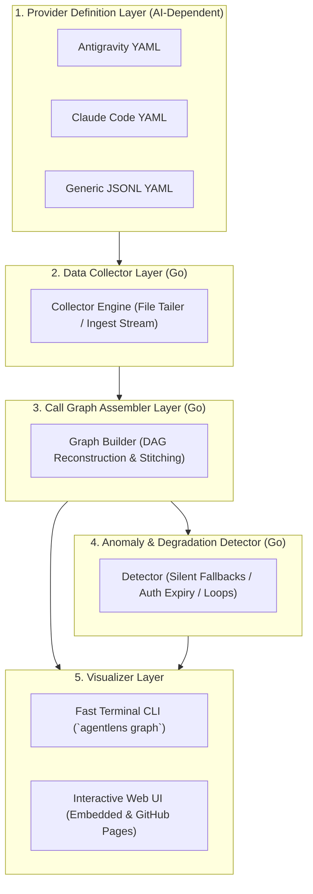

# AgentLens 🔍

> **Zero-Dependency Observability & Call Graph Visualizer for Generative AI Skills, MCPs, and Subagents**

[](https://opensource.org/licenses/MIT)
[](https://go.dev/)
[](README.md)
[](README.ja.md)
[](https://tsbkw.github.io/agentlens)

---

## 🌟 Overview

When running Generative AI agents—especially in autonomous **auto mode**—they dynamically invoke a wide array of **SKILLs**, **MCP (Model Context Protocol) servers**, and subagents.

However, visibility into what is *actually* executing behind the scenes is often opaque. When an external MCP tool's authentication expires or a skill encounters an issue, the agent frequently attempts **silent fallbacks** without notifying the user (for example, falling back from a dedicated GitHub MCP tool to raw shell `curl` / `gh` commands, or routing through an indirect tool). This results in context loss, unexpected degradation of output quality, and wasted turns.

**AgentLens** brings complete transparency to AI tool interactions:
- 🚀 **Zero-Dependency Single Binary**: Written in Go. Runs instantly on macOS, Linux, and Windows with **no Python, no Node.js, and no runtime installation required**.
- 📊 **Call Graph Reconstruction**: Reassembles complex agent execution flows, SKILL calls, and MCP invocations into a structured Directed Acyclic Graph (DAG).
- 🚨 **Silent Fallback & Anomaly Detection**: Automatically flags authentication expirations (HTTP 401/403), indirect proxy routing, and silent tool substitutions.
- 🔌 **Provider-Agnostic Design**: Decouples all AI platform dependencies into declarative YAML provider definitions. Supports Google Antigravity, Claude Code, Cursor, and custom agent traces.
- 🖥️ **CLI & Web UI Visualizations**:
  - **Terminal CLI**: Inspect executions instantly in your terminal via formatted trees with colored status and anomaly badges.
  - **Web UI**: Both embedded inside the Go binary (`agentlens ui`) for local offline use, and hosted 100% free on **GitHub Pages** (where you can drag-and-drop traces to inspect entirely in-browser without sending data to any external server).

---

## 🏗️ Architecture

AgentLens enforces a strict **5-Layer Separation of Concerns**. Only Layer 1 has any awareness of specific Generative AI systems or trace formats:



---

## 🌐 Free Web UI on GitHub Pages & Local UI

AgentLens provides two ways to experience the Web UI:

1. **GitHub Pages (Free Online Viewer)**:
   - Hosted at `https://tsbkw.github.io/agentlens` at zero hosting cost.
   - **100% Private Client-Side Execution**: Drag and drop your session trace log (`transcript.jsonl` or JSON export) directly onto the page. The graph is computed and rendered entirely in your browser—no data is sent to external servers.
2. **Local Embedded Server (`agentlens ui`)**:
   - The Go binary bundles the compiled Web UI using Go's `embed` mechanism.
   - Simply run `agentlens ui` to launch a local server and auto-open your default browser without needing internet access or Node.js.

---

## ⚡ Planned CLI Usage

```bash
# List recorded AI execution sessions
agentlens list

# Render call graph in the terminal with colored status & anomaly highlights
agentlens graph <session-id>

# Inspect detailed input arguments, results, and anomaly diagnosis for a node
agentlens inspect <call-id>

# Launch the interactive local Web UI dashboard (embedded, zero dependencies)
agentlens ui --port 8000

# Live-watch an ongoing AI session in real-time
agentlens watch --provider antigravity
```

---

## 📋 How to Open an Issue

We welcome feedback, bug reports, and provider requests! Before opening an issue, please check existing issues to avoid duplicates.

1. **Bug Reports**:
   - Use the [Bug Report Template](.github/ISSUE_TEMPLATE/bug_report.md).
   - Please include: operating system, AgentLens version, target AI provider, sample trace snippet (with sensitive credentials redacted), and reproduction steps.
2. **Feature Requests & Suggestions**:
   - Use the [Feature Request Template](.github/ISSUE_TEMPLATE/feature_request.md).
   - Describe the use case, why it matters, and proposed interfaces or behavior.
3. **New AI Provider Requests**:
   - If you want AgentLens to support a new AI tool (e.g. Cursor, Roo Code, Cline), please share example log snippets, default log storage paths, and how skills/tools are represented.

---

## 🤝 Contribution Guidelines & PR Workflow

AgentLens welcomes contributions from both human developers and AI pair programmers!

### Branch & Pull Request Workflow
1. **Branch Protection & Review Rules**:
   - The `main` branch is protected. Direct pushes to `main` are disallowed.
   - Pull Requests from contributors require **at least 1 approving review from maintainers** before merging.
   - Repository maintainers can review, approve, and merge pull requests at any time.
2. **Branch Naming**:
   - `feat/<feature-name>`: New features
   - `fix/<bug-name>`: Bug fixes
   - `docs/<doc-name>`: Documentation updates
   - `refactor/<target>`: Refactoring
3. **Submitting Changes**:
   ```bash
   # 1. Clone and create a branch
   git checkout -b feat/my-feature

   # 2. Make changes and verify
   go test ./...
   go vet ./...

   # 3. Commit and push
   git commit -m "feat: add support for new feature"
   git push origin feat/my-feature

   # 4. Open a Pull Request
   gh pr create --fill
   ```
4. **Coding & Language Standards**:
   - **Code & Comments**: Strictly in **English**.
   - **Documentation**: Maintained in both English (`docs/en/`) and Japanese (`docs/ja/`).
   - Every feature PR must update the task checklist in [`docs/en/ROADMAP.md`](docs/en/ROADMAP.md) and [`docs/ja/ROADMAP.md`](docs/ja/ROADMAP.md).

For full details, please read our [Contributing Guidelines](docs/en/CONTRIBUTING.md).

---

## 📚 Documentation Index

| Document | English | 日本語 | Description |
| :--- | :--- | :--- | :--- |
| **Functional Specification** | [Specification](docs/en/SPECIFICATION.md) | [仕様書](docs/ja/SPECIFICATION.md) | Detailed requirements, user stories, and layer specs |
| **System Architecture** | [Architecture](docs/en/ARCHITECTURE.md) | [アーキテクチャ](docs/ja/ARCHITECTURE.md) | Go modules, data models, sequence diagrams, and UI embed |
| **Roadmap & Progress** | [Roadmap](docs/en/ROADMAP.md) | [ロードマップ](docs/ja/ROADMAP.md) | Development phases, task tracking, and PR links |
| **Contributing Guidelines** | [Contributing](docs/en/CONTRIBUTING.md) | [開発規約](docs/ja/CONTRIBUTING.md) | PR workflow, branching strategy, and code standards |

---

## 📄 License

This project is licensed under the [MIT License](LICENSE).