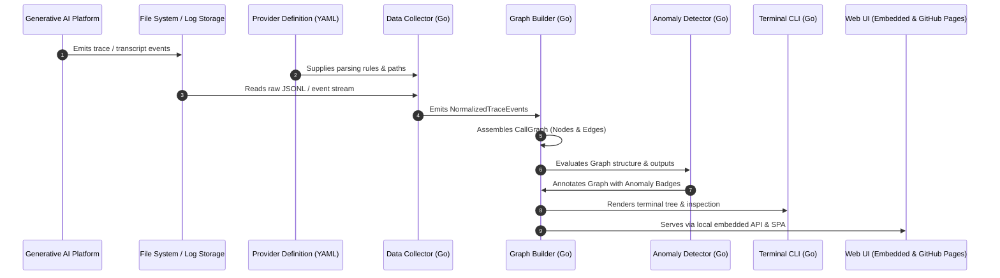

# AgentLens: System Architecture

> **Language**: [English](ARCHITECTURE.md) | [日本語](../ja/ARCHITECTURE.md)

---

## 1. System Overview

AgentLens processes raw Generative AI execution traces into an enriched, anomaly-annotated Call Graph. It guarantees complete independence from specific AI platforms by strictly isolating vendor formats into declarative **Provider Definitions**, and ensures zero environment friction by delivering as a **single standalone Go binary with an embedded Web UI** plus a **free client-side viewer on GitHub Pages**.



---

## 2. Directory Structure & Module Breakdown

```text
agentlens/
├── .github/
│   ├── workflows/
│   │   ├── ci.yml                 # Go test, lint, and build verification
│   │   └── deploy-pages.yml       # Automated build & deploy to GitHub Pages
│   ├── ISSUE_TEMPLATE/
│   │   ├── bug_report.md
│   │   └── feature_request.md
│   └── pull_request_template.md
├── cmd/
│   └── agentlens/
│       └── main.go                # CLI entrypoint (Cobra / Lipgloss)
├── docs/
│   ├── en/
│   │   ├── ARCHITECTURE.md
│   │   ├── CONTRIBUTING.md
│   │   ├── ROADMAP.md
│   │   └── SPECIFICATION.md
│   └── ja/
│       ├── ARCHITECTURE.md
│       ├── CONTRIBUTING.md
│       ├── ROADMAP.md
│       └── SPECIFICATION.md
├── examples/
│   └── providers/
│       ├── antigravity.yaml
│       └── generic_jsonl.yaml
├── internal/
│   ├── collector/                 # Ingestion, file watching (fsnotify), streams
│   │   ├── collector.go
│   │   └── tailer.go
│   ├── detector/                  # Anomaly, fallback, auth check algorithms
│   │   ├── auth_checker.go
│   │   ├── fallback_detector.go
│   │   └── loop_detector.go
│   ├── graph/                     # Graph building, DAG representation & metrics
│   │   ├── builder.go
│   │   └── metrics.go
│   ├── models/                    # Core data models (Trace, Node, Edge, Anomaly)
│   │   ├── anomaly.go
│   │   ├── graph.go
│   │   ├── provider.go
│   │   └── trace.go
│   ├── providers/                 # Provider definition parser & loader
│   │   ├── loader.go
│   │   └── parser.go
│   └── server/                    # Local HTTP API & embedded UI server
│       └── server.go
├── schemas/
│   └── provider_definition.schema.json
├── web/                           # Web UI SPA (dist embedded into Go + GitHub Pages)
│   ├── index.html
│   └── src/
├── go.mod
├── go.sum
├── README.md
└── README.ja.md
```

---

## 3. Data Models (`internal/models`)

### 3.1 `CallNodeType`
```go
type CallNodeType string

const (
    NodeTypeUserTurn   CallNodeType = "user_turn"
    NodeTypeAgent      CallNodeType = "agent"
    NodeTypeSubagent   CallNodeType = "subagent"
    NodeTypeSkill      CallNodeType = "skill"
    NodeTypeMCPTool    CallNodeType = "mcp_tool"
    NodeTypeSystemTool CallNodeType = "system_tool"
)
```

### 3.2 `CallNode`
Represents an individual execution node within the graph:
```go
type CallNode struct {
    ID           string                 `json:"id"`
    SessionID    string                 `json:"session_id"`
    ParentID     string                 `json:"parent_id,omitempty"`
    Type         CallNodeType           `json:"type"`
    Name         string                 `json:"name"`
    MCPServer    string                 `json:"mcp_server,omitempty"`
    Timestamp    time.Time              `json:"timestamp"`
    DurationMs   int64                  `json:"duration_ms"`
    Status       string                 `json:"status"` // "success", "failed", "timeout"
    Arguments    map[string]interface{} `json:"arguments,omitempty"`
    Output       interface{}            `json:"output,omitempty"`
    ErrorMessage string                 `json:"error_message,omitempty"`
    Anomalies    []AnomalyRecord        `json:"anomalies,omitempty"`
}
```

### 3.3 `CallEdge`
```go
type CallEdgeType string

const (
    EdgeTypeCalls      CallEdgeType = "calls"
    EdgeTypeSpawns     CallEdgeType = "spawns"
    EdgeTypeFallbackTo CallEdgeType = "fallback_to"
    EdgeTypeRetries    CallEdgeType = "retries"
)

type CallEdge struct {
    SourceID string       `json:"source_id"`
    TargetID string       `json:"target_id"`
    Type     CallEdgeType `json:"type"`
}
```

### 3.4 `AnomalyRecord`
```go
type AnomalyType string

const (
    AnomalySilentFallback AnomalyType = "silent_fallback"
    AnomalyAuthExpired    AnomalyType = "auth_expired"
    AnomalyProxyRouting   AnomalyType = "proxy_routing"
    AnomalyRetryLoop      AnomalyType = "retry_loop"
    AnomalyLatencySpike   AnomalyType = "latency_spike"
)

type AnomalyRecord struct {
    ID             string      `json:"id"`
    Type           AnomalyType `json:"type"`
    Severity       string      `json:"severity"` // "info", "warning", "critical"
    NodeID         string      `json:"node_id"`
    RelatedNodeID  string      `json:"related_node_id,omitempty"`
    Title          string      `json:"title"`
    Description    string      `json:"description"`
    Recommendation string      `json:"recommendation,omitempty"`
}
```

---

## 4. Web UI Dual-Hosting Architecture

AgentLens's Web UI is built as a portable Single Page Application (SPA):
1. **GitHub Pages Deployment**:
   - Built statically via `.github/workflows/deploy-pages.yml` and hosted at `https://tsbkw.github.io/agentlens`.
   - 100% private: users can drag and drop trace files directly onto the browser window. Log parsing and graph rendering execute client-side via JavaScript without transmitting data to any server.
2. **Local Embedded Server**:
   - The compiled static files in `web/` are embedded inside the Go binary using Go 1.16+ `//go:embed web/dist/*`.
   - Running `agentlens ui` spins up a local HTTP server and automatically opens the browser.
