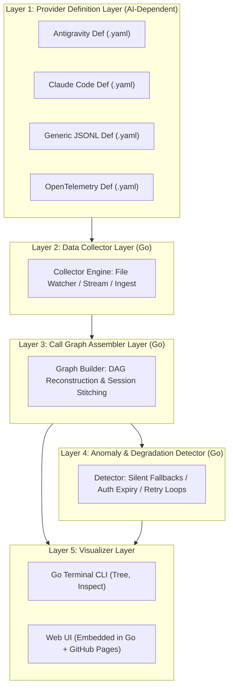

# AgentLens: Functional Specification

> **Language**: [English](SPECIFICATION.md) | [日本語](../ja/SPECIFICATION.md)

---

## 1. Overview & Problem Statement

### 1.1 The Challenge
Modern Generative AI systems operating in **autonomous / auto mode** orchestrate multi-step workflows by dynamically invoking specialized **SKILLs**, **MCP (Model Context Protocol) servers**, subagents, and internal tools.

However, visibility into what is *actually* executing behind the scenes is often opaque:
- **Silent Degradation & Fallbacks**: If an external MCP server's credentials expire (e.g., HTTP 401/403 or OAuth expiration), or a skill fails, the AI frequently attempts silent workarounds without user alert. For example, instead of directly invoking an authorized `github_mcp.create_issue` tool, the agent may silently pivot to executing shell commands (`gh issue create` or `curl`) or secondary tools, which may lack necessary context, fail midway, or yield degraded output.
- **Unintended Inefficiencies**: Users cannot readily determine whether the AI used the intended specialized tool, wasted turns on retrying failed tool invocations, or took a suboptimal detour.
- **Black-box Multi-Agent Execution**: When subagents are spawned, nested call hierarchies and tool-sharing behaviors become difficult to inspect and verify.

### 1.2 The Goal
**AgentLens** provides observability and call graph visualization for Generative AI skill and tool executions. It reconstructs execution histories as an interactive, inspectable **Call Graph (DAG)**, identifies runtime anomalies and silent fallbacks, and presents actionable insights via both a **Terminal CLI** and a **Web UI Dashboard**.

### 1.3 Environment Independence Principles
To avoid environmental friction (e.g. Python version mismatches, virtual environment conflicts, or requiring Node.js/npm on the user's machine):
1. **Single Standalone Binary in Go**: Distributed as a single binary with **zero runtime requirements** (no Python or Node.js required for the end user).
2. **Pre-Built Embedded Web UI**: The Web UI assets are bundled directly into the Go binary using `//go:embed`. Running `agentlens ui` serves the application locally offline with zero setup.
3. **Free GitHub Pages Hosting**: The same Web UI is statically built and hosted at `https://tsbkw.github.io/agentlens` for free via GitHub Pages, enabling zero-install, privacy-first client-side trace inspection via drag-and-drop.

---

## 2. Core Architectural Principles

To ensure AgentLens remains future-proof and independent of specific AI vendors, it enforces a strict **5-Layer Separation of Concerns**:

### Principle: Strict Provider Isolation
**Only Layer 1 (Provider Definitions) contains knowledge of specific Generative AI systems or trace formats.**
Layers 2 through 5 operate entirely on normalized internal data models (`CallNode`, `CallEdge`, `ExecutionSession`, `AnomalyReport`). Adding support for a new AI framework (e.g., Cursor, Roo Code, LangChain) requires only a declarative configuration file, with zero modifications to the core Go engine.

---

## 3. Detailed Component Specifications

### 3.1 Layer 1: Provider Definition Layer
Declarative YAML/JSON files adhering to [`provider_definition.schema.json`](file:///home/tsbkw0/development/agentlens/schemas/provider_definition.schema.json).

- **Source Configuration**: Defines where and how trace data is read (`file`, `directory_watch`, `command`, `otel_collector`).
- **Extraction Rules**:
  - `session`: Rule to determine conversation or session ID.
  - `events`: Filter criteria to locate tool invocations and subagent activations.
  - `fields`: Field mappings for timestamp, call ID, parent caller, tool name, MCP server name, parameters, result, status, and execution duration.
- **Anomaly Heuristics**: Provider-specific regex patterns for auth expiration and known fallback pairs.

### 3.2 Layer 2: Data Collector Layer (Go)
- Ingests raw events according to the active provider definition.
- Supports both **historical analysis** (reading existing logs/transcripts) and **live tailing** (watching active logs via filesystem events).
- Normalizes raw trace entries into standardized event structures: `RawTraceEvent`.

### 3.3 Layer 3: Call Graph Assembler Layer (Go)
- Transforms normalized events into a Directed Acyclic Graph (DAG).
- **Node Taxonomy**:
  - `UserTurnNode`: User prompt and intent boundary.
  - `AgentNode`: Primary agent or spawned subagent.
  - `SkillNode`: Invocation of high-level SKILL logic.
  - `MCPToolNode`: Invocation of an external MCP tool, tagged with `mcp_server`.
  - `SystemToolNode`: Native/builtin tools (e.g., shell, file read/write).
- **Edge Taxonomy**:
  - `calls`: Direct parent-to-child invocation.
  - `spawns`: Agent spawning a subagent.
  - `fallbacks_to`: An execution failure transitioning to an alternative tool attempt.
  - `retries`: Re-attempting the same tool after failure.
- Computes execution metrics: wall-clock duration, call depth, fan-out, and cumulative token/time consumption.

### 3.4 Layer 4: Anomaly & Degradation Detector (Go)
Detects execution anomalies and alerts the developer:
1. **Silent Fallback Detection**:
   - Detects when an intended tool (e.g., MCP tool) fails or returns an auth error, followed immediately by an alternative tool (e.g., shell command or proxy tool) aimed at achieving the same objective.
2. **Credential & Authentication Expiration**:
   - Identifies HTTP 401, 403, "token expired", or OAuth refresh failures within tool execution responses.
3. **Suboptimal Routing / Proxying**:
   - Flags patterns where Tool A was accessed indirectly via Tool B due to lack of direct tool connectivity.
4. **Retry Loops & Thrashing**:
   - Flags 3 or more repeated failures on the same tool or alternating tool failures without progress.
5. **Execution Latency Spikes**:
   - Highlights nodes with runtimes significantly higher than baseline percentiles.

### 3.5 Layer 5: Visualizers

#### 3.5.1 CLI Visualizer (`agentlens`)
- **`agentlens list`**: List recorded sessions and detected providers.
- **`agentlens graph <session-id>`**: Render fast tree call graphs in terminal with colored status indicators (green = success, red = error, yellow = fallback alert).
- **`agentlens inspect <call-id>`**: Display full details, arguments, outputs, and anomaly diagnostics for a specific node.
- **`agentlens watch`**: Live terminal monitor tailing active AI interactions in real-time.

#### 3.5.2 Web UI Dashboard (Embedded & GitHub Pages)
- **Local Embedded Server**: Running `agentlens ui` serves the embedded pre-compiled SPA and opens the browser.
- **Free GitHub Pages Hosting**: Statically hosted at `https://tsbkw.github.io/agentlens` with client-side drag-and-drop log visualization.
- **Interactive Call Graph Viewer**: Node-edge canvas (zoom, pan, hierarchical layout).
- **Timeline / Waterfall View**: Gantt-style chart showing tool durations and concurrency.
- **Anomaly Banner & Inspector Drawer**: Prominent alert cards detailing detected silent fallbacks, auth failures, and recommendations.
- **Search & Filter**: Filter by status, tool name, MCP server, or anomaly type.

---

## 4. Internationalization (i18n) Strategy
- **Code & Developer Comments**: Strictly English (`en`).
- **Documentation**: Dual maintenance in English (`docs/en/`) and Japanese (`docs/ja/`).
- **User-Facing CLI & Web UI**:
  - Default language: English.
  - Configurable to Japanese via `--lang ja` flag, environment variable `AGENTLENS_LANG=ja`, or config file.
  - Locale resource dictionaries maintained for CLI and Web UI.
