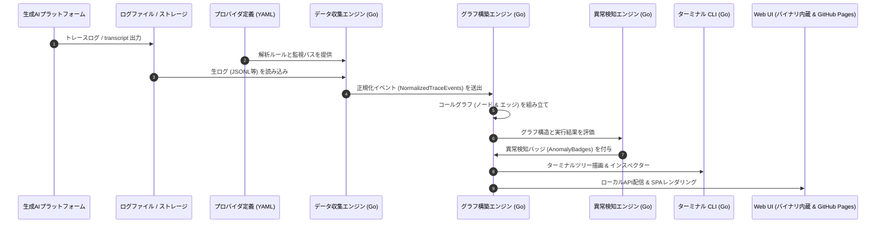

# AgentLens: システムアーキテクチャ設計書 (System Architecture)

> **言語切り替え**: [English](../en/ARCHITECTURE.md) | [日本語](ARCHITECTURE.md)

---

## 1. システム全体図

AgentLens は、生成AIの生実行トレースを解析し、異常検知・注釈付きのコールグラフを構築します。特定の生成AI製品への依存を宣言的**プロバイダ定義 (Provider Definition)** に完全に局所化し、**Go言語による単一バイナリ配布** と **GitHub Pages 無料Web UI** を組み合わせることで、ユーザーの環境依存トラブルを根絶します。



---

## 2. ディレクトリ構成とモジュール設計

```text
agentlens/
├── .github/
│   ├── workflows/
│   │   ├── ci.yml                 # Go テスト・ビルド検証
│   │   └── deploy-pages.yml       # GitHub Pages への自動デプロイ
│   ├── ISSUE_TEMPLATE/
│   │   ├── bug_report.md
│   │   └── feature_request.md
│   └── pull_request_template.md
├── cmd/
│   └── agentlens/
│       └── main.go                # CLI エントリーポイント
├── docs/
│   ├── en/
│   │   ├── ARCHITECTURE.md
│   │   ├── CONTRIBUTING.md
│   │   ├── ROADMAP.md
│   │   └── SPECIFICATION.md
│   └── ja/
│       ├── ARCHITECTURE.md
│       ├── CONTRIBUTING.md
│       ├── ROADMAP.md
│       └── SPECIFICATION.md
├── examples/
│   └── providers/
│       ├── antigravity.yaml
│       └── generic_jsonl.yaml
├── internal/
│   ├── collector/                 # ログ収集・監視 (fsnotify)
│   │   ├── collector.go
│   │   └── tailer.go
│   ├── detector/                  # 異常・暗黙フォールバック・認証切れ検知
│   │   ├── auth_checker.go
│   │   ├── fallback_detector.go
│   │   └── loop_detector.go
│   ├── graph/                     # コールグラフ構築・DAG表現・メトリクス計算
│   │   ├── builder.go
│   │   └── metrics.go
│   ├── models/                    # コアデータモデル (Trace, Node, Edge, Anomaly)
│   │   ├── anomaly.go
│   │   ├── graph.go
│   │   ├── provider.go
│   │   └── trace.go
│   ├── providers/                 # プロバイダ定義ローダー・パーサー
│   │   ├── loader.go
│   │   └── parser.go
│   └── server/                    # ローカルHTTP API & 組み込みUIサーバー
│       └── server.go
├── schemas/
│   └── provider_definition.schema.json
├── web/                           # Web UI SPA (Goバイナリ内蔵 + GitHub Pages)
│   ├── index.html
│   └── src/
├── go.mod
├── go.sum
├── README.md
└── README.ja.md
```

---

## 3. コアデータモデル (`internal/models`)

### 3.1 `CallNodeType` (ノード種別)
```go
type CallNodeType string

const (
    NodeTypeUserTurn   CallNodeType = "user_turn"
    NodeTypeAgent      CallNodeType = "agent"
    NodeTypeSubagent   CallNodeType = "subagent"
    NodeTypeSkill      CallNodeType = "skill"
    NodeTypeMCPTool    CallNodeType = "mcp_tool"
    NodeTypeSystemTool CallNodeType = "system_tool"
)
```

### 3.2 `CallNode` (ノード定義)
```go
type CallNode struct {
    ID           string                 `json:"id"`
    SessionID    string                 `json:"session_id"`
    ParentID     string                 `json:"parent_id,omitempty"`
    Type         CallNodeType           `json:"type"`
    Name         string                 `json:"name"`
    MCPServer    string                 `json:"mcp_server,omitempty"`
    Timestamp    time.Time              `json:"timestamp"`
    DurationMs   int64                  `json:"duration_ms"`
    Status       string                 `json:"status"` // "success", "failed", "timeout"
    Arguments    map[string]interface{} `json:"arguments,omitempty"`
    Output       interface{}            `json:"output,omitempty"`
    ErrorMessage string                 `json:"error_message,omitempty"`
    Anomalies    []AnomalyRecord        `json:"anomalies,omitempty"`
}
```

### 3.3 `CallEdge` (エッジ定義)
```go
type CallEdgeType string

const (
    EdgeTypeCalls      CallEdgeType = "calls"
    EdgeTypeSpawns     CallEdgeType = "spawns"
    EdgeTypeFallbackTo CallEdgeType = "fallback_to"
    EdgeTypeRetries    CallEdgeType = "retries"
)

type CallEdge struct {
    SourceID string       `json:"source_id"`
    TargetID string       `json:"target_id"`
    Type     CallEdgeType `json:"type"`
}
```

### 3.4 `AnomalyRecord` (異常検知レコード)
```go
type AnomalyType string

const (
    AnomalySilentFallback AnomalyType = "silent_fallback"
    AnomalyAuthExpired    AnomalyType = "auth_expired"
    AnomalyProxyRouting   AnomalyType = "proxy_routing"
    AnomalyRetryLoop      AnomalyType = "retry_loop"
    AnomalyLatencySpike   AnomalyType = "latency_spike"
)

type AnomalyRecord struct {
    ID             string      `json:"id"`
    Type           AnomalyType `json:"type"`
    Severity       string      `json:"severity"` // "info", "warning", "critical"
    NodeID         string      `json:"node_id"`
    RelatedNodeID  string      `json:"related_node_id,omitempty"`
    Title          string      `json:"title"`
    Description    string      `json:"description"`
    Recommendation string      `json:"recommendation,omitempty"`
}
```

---

## 4. Web UI の二重配信設計 (Dual-Hosting Architecture)

AgentLens の Web UI は、単一のSPA（Single Page Application）としてビルドされます:
1. **GitHub Pages による無料ホスティング**:
   - `.github/workflows/deploy-pages.yml` によって自動ビルドされ、`https://tsbkw.github.io/agentlens` に完全無料で常時公開されます。
   - **完全クライアントサイド実行（高セキュリティ）**: ユーザーがトレースファイル（`transcript.jsonl` 等）をブラウザへドラッグ＆ドロップすると、JavaScriptがすべてローカルで解析・描画します。外部サーバーへの通信は一切行われません。
2. **Goバイナリへの内蔵 (`//go:embed`)**:
   - コンパイルされた静的ファイルは Go の `//go:embed` 機能によりバイナリに同梱されます。
   - `agentlens ui` を実行すると、ローカルHTTPサーバーが立ち上がり、自動的にブラウザで同一のダッシュボードが表示されます。
