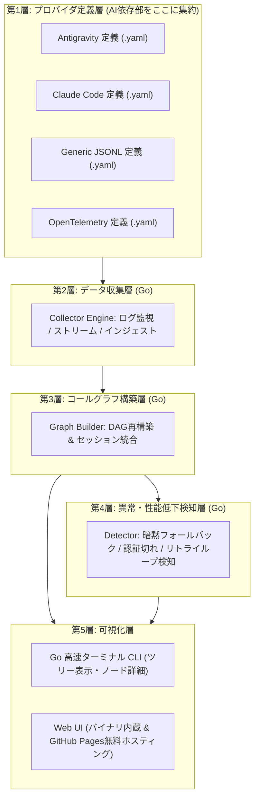

# AgentLens: 機能仕様書 (Functional Specification)

> **言語切り替え**: [English](../en/SPECIFICATION.md) | [日本語](SPECIFICATION.md)

---

## 1. 概要と課題意識 (Overview & Problem Statement)

### 1.1 解決する課題
自律実行モード（auto mode）で動作する現代の生成AIシステムは、**SKILL**、**MCP (Model Context Protocol) サーバー**、サブエージェント、内部ツールなどを動的に組み合わせて多段階のタスクを実行します。

しかし、実行の裏側で「実際に何がどのように呼び出されているのか」は極めて不透明になりがちです:
- **暗黙的な性能低下とフォールバック (Silent Degradation & Fallbacks)**:
  外部MCPの認証（OAuthやAPIキー等）が期限切れになった場合やSKILLでエラーが発生した際、AIはユーザーに通知することなく別の手段を勝手に試すことがあります。例えば、本来直接呼び出すはずの外部MCPツール（例: `github_mcp.create_issue`）が認証切れで失敗した結果、暗黙的にシェルコマンド（`gh issue create` や `curl`）や別の二次ツール経由でアクセスしようとし、コンテキストが抜け落ちたり、機能が制限されたり、低品質な結果に終わることが頻発します。
- **意図せぬ非効率のブラックボックス化**:
  ユーザーは、AIが意図通りの専門ツールを呼び出したのか、失敗を繰り返して無駄なターンを消費したのか、あるいは不十分な迂回ルートを取ったのかを事後的に把握することが困難です。
- **マルチエージェントの呼び出し階層の複雑化**:
  サブエージェントが子プロセスとして起動された場合、どのエージェントがどのツールやMCPを共有・実行したのかを追跡することが難しくなります。

### 1.2 本ツールの目的
**AgentLens** は、生成AIとのやり取りで実行されたSKILLやMCP等のツール呼び出しを構造化し、**コールグラフ（有向非巡回グラフ: DAG）** として可視化するオブザーバビリティ（可観測性）ツールです。
実行履歴からコールグラフを再構築し、認証切れや暗黙的フォールバックなどの**異常・性能低下（Anomaly）を自動検知**し、**コマンドライン（CLI）** および **Web UI** の双方で分かりやすく提示します。

### 1.3 環境非依存性への設計指針
Pythonのバージョン不整合、仮想環境のコンフリクト、Node.js/npmの事前要求といった環境起因のトラブルを完全に排除します:
1. **Go言語による単一バイナリ配布**: ユーザーのPCに **Python も Node.js も不要** な単一実行ファイルとして提供。
2. **Web UI のバイナリ内蔵（embed）**: 事前ビルドされたWeb UIアセットをGoバイナリに同梱。`agentlens ui` 1発でオフラインでも即座にブラウザ起動。
3. **GitHub Pages による無料ホスティング**: 同じWeb UIを `https://tsbkw.github.io/agentlens` に完全無料ホスティング。手元のログをブラウザにドラッグ＆ドロップするだけで、サーバー送信なしの完全ローカル処理で即座に可視化が可能。

---

## 2. コア設計思想 (Core Architectural Principles)

AgentLens は、将来にわたって特定のAIベンダーやモデルに縛られないよう、**5層の責任分離（5-Layer Separation of Concerns）** を徹底します:

### 設計原則: AIプロバイダ依存の完全分離
**生成AI製品ごとのログ形式やトレース取得方法に関する依存は、すべて「第1層（プロバイダ定義層）」に限定します。**
第2層〜第5層のコアロジックは、正規化された内部データモデル（`CallNode`, `CallEdge`, `ExecutionSession`, `AnomalyReport`）のみを相手に動作します。新しい生成AI（Cursor, Roo Code, LangChain等）に対応する際は、設定ファイル（YAML/JSON）を1つ追加・定義するだけで対応可能であり、コアエンジンの修正は不要です。

---

## 3. コンポーネント別詳細仕様 (Detailed Component Specifications)

### 3.1 第1層: プロバイダ定義層 (Provider Definition Layer)
[`provider_definition.schema.json`](file:///home/tsbkw0/development/agentlens/schemas/provider_definition.schema.json) に準拠する宣言的YAML/JSONファイル。

- **データソース設定**: トレースデータの場所・取得方法（`file`, `directory_watch`, `command`, `otel_collector`）。
- **抽出ルール**:
  - `session`: 会話・セッションIDの抽出パスや正規表現。
  - `events`: ツール呼び出しやサブエージェント起動ステップのフィルタ条件。
  - `fields`: タイムスタンプ、呼び出しID、呼び出し元、ツール名、MCPサーバー名、引数、戻り値、成否ステータス、所要時間のマッピング。
- **異常検知ヒューリスティクス**: 認証切れを示す正規表現、既知のフォールバック対（例: `mcp_*` 失敗後に `run_command` へフォールバック）。

### 3.2 第2層: データ収集層 (Data Collector Layer in Go)
- 有効なプロバイダ定義に従って生イベントを収集。
- **過去ログ解析（バッチ）** と **ライブ監視（tail / watch）** の双方に対応。
- 生ログを共通の `RawTraceEvent` へ正規化。

### 3.3 第3層: コールグラフ構築層 (Call Graph Assembler Layer in Go)
- 正規化されたイベント列から、有向非巡回グラフ（DAG）を組み立て。
- **ノード種別**:
  - `UserTurnNode`: ユーザーの指示・プロンプト単位。
  - `AgentNode`: メインエージェントまたはサブエージェント。
  - `SkillNode`: 高レベルなSKILL呼び出し。
  - `MCPToolNode`: 外部MCPサーバーが提供するツールの呼び出し（サーバー名属性付き）。
  - `SystemToolNode`: 組み込みツール（シェルコマンド、ファイル操作等）。
- **エッジ種別**:
  - `calls`: 直接の親子呼び出し。
  - `spawns`: サブエージェントの起動。
  - `fallbacks_to`: ツール失敗からの代替ツールへの暗黙的移行。
  - `retries`: 同一ツールの再試行。
- 所要時間、深さ、ファンアウト、累積トークン/時間等のメトリクスを算出。

### 3.4 第4層: 異常・性能低下検知層 (Anomaly & Degradation Detector in Go)
AIの意図せぬ動作や性能劣化をルール・ヒューリスティクスに基づいて自動検出:
1. **暗黙的フォールバック検知 (Silent Fallback)**:
   本来実行されるべきツール（例: MCPツール）が失敗または認証エラーを起こし、直後に同一目的と推定される別ツール（例: シェルや代替ツール）を実行した遷移を検知。
2. **認証切れ検知 (Auth Expiration)**:
   HTTP 401, 403, "token expired", OAuth再認証失敗などのエラーメッセージや戻り値を検知。
3. **迂回ルーティング検知 (Suboptimal Routing / Proxying)**:
   本来直接アクセスすべきツールAへのアクセス権がないため、ツールBを経由して迂回アクセスしているケースを検出。
4. **リトライループ・スタック検知 (Retry Loops)**:
   同一ツールや交互のツール呼び出しが3回以上連続で失敗している状態を検出。
5. **レイテンシ異常 (Latency Spikes)**:
   平均値を著しく超える処理遅延が発生しているノードを特定。

### 3.5 第5層: 可視化層 (Visualizer Layer)

#### 3.5.1 コマンドラインツール (`agentlens` CLI)
- **`agentlens list`**: 記録されたセッション一覧および検出されたプロバイダの表示。
- **`agentlens graph <session-id>`**: ターミナル上でのツリー型/階層型コールグラフ描画（成功=緑、エラー=赤、フォールバック警告=黄）。
- **`agentlens inspect <call-id>`**: 特定ノードの引数・出力・異常検知結果の詳細表示。
- **`agentlens watch`**: 実行中のAIセッションをターミナルでリアルタイム監視。

#### 3.5.2 Web UI ダッシュボード (内蔵 & GitHub Pages)
- **GitHub Pages 無料ホスティング**: `https://tsbkw.github.io/agentlens` にてホスティング。手元のログをドラッグ＆ドロップするだけで、サーバー通信不要の安全な完全ローカル描画。
- **ローカル内蔵サーバー**: `agentlens ui` でGo内蔵のWebサーバーが立ち上がり、オフラインでも利用可能。
- **インタラクティブ・コールグラフビュー**: ズーム・パン・階層整列が可能なノード・エッジキャンバス。
- **タイムライン / ウォーターフォールビュー**: ガントチャート形式でのツール並列度・所要時間可視化。
- **異常値警告バナー & インスペクター**: 検出された暗黙フォールバックや認証エラーを強調表示し、原因と推奨アクションを提示。
- **検索・フィルタリング**: ステータス、ツール名、MCPサーバー名、異常種別による絞り込み。

---

## 4. 多言語対応 (i18n) 方針
- **ソースコードおよびコメント**: 英語（`en`）で統一。
- **ドキュメント**: 英語（`docs/en/`）を正本とし、日本語（`docs/ja/`）を完全対応で保守。
- **ユーザーインターフェース (CLI / Web UI)**:
  - デフォルト言語: 英語。
  - `--lang ja` オプション、環境変数 `AGENTLENS_LANG=ja`、または設定ファイルにて日本語に切り替え可能。
